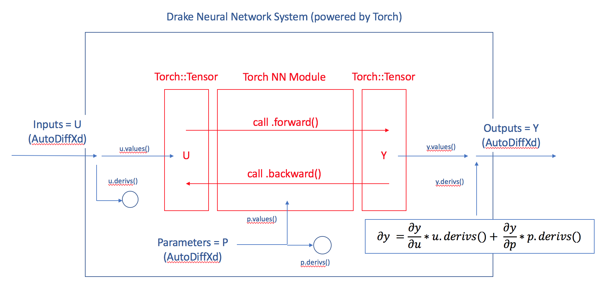

Contains:
 - NNSystem.py
   - NNSystem that accepts a PyTorch NN object at init.
   - Eval computes a forward pass with inputs and optionally uses parameters declared in context.
 - NNSystemTest.py
   - Tests autodiff gradients of outputs w.r.t. inputs and context parameters.

